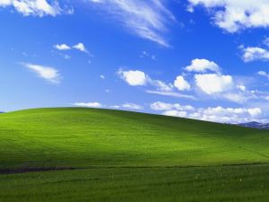
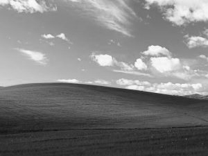
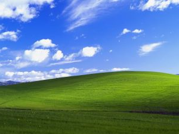
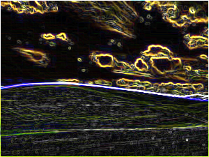

# BMP-Filter-Tool

**bmpfilter** is a command-line tool for applying various filters to BMP images such as **Grayscale**, **Reflection**, **Blur**, and **Edge Detection**.

## Table of Contents

- [Introduction](#introduction)
- [How to Use](#how-to-use)
- [Example](#example)
- [License](#license)

## Introduction

This program allows you to process BMP image files with various filters, offering visual effects for your images. You can easily apply the filters by running the tool from the command line.

Available filters:

- Grayscale (-g): Converts the image to black and white
- Reflection (-r): Creates a mirror reflection of the image
- Blur (-b): Blurs the image using a simple technique
- Edges (-e): Enhances the edges in the image using the Sobel operator
  
For more detailed information about the Sobel operator, please visit: https://en.wikipedia.org/wiki/Sobel_operator

## How to Use

1. Clone the repository to your local machine:
   ```sh
   git clone https://github.com/ggulteki/BMP-Filter-Tool.git
   ```

2. Compile the source code to build the bmpfilter program:
   ```sh
   make
   ```

3. Look at the [Example](#example) section for usage instructions.

4. To remove object files and intermediate build artifacts:
   ```sh
   make clean
   ```

5. To remove all build artifacts, including the binary:
   ```sh
   make fclean
   ```

6. To rebuild the bmpfilter program from scratch:
   ```sh
   make re
   ```

## Example

### Using Grayscale

Before:



```sh
./bmpfilter -g img/default.bmp img/grayscale.bmp
```

After:



### Using Reflection

Before:


```sh
./bmpfilter -r img/default.bmp img/reflection.bmp
```

After:



### Using Blur

Before:


```sh
./bmpfilter -b img/default.bmp img/blur.bmp
```

After:


### Using Edges

Before:


```sh
./bmpfilter -e img/default.bmp img/edges.bmp
```

After:



## License

This project is open source and distributed under the GNU General Public License version 3.0 (GPL-3.0).

[](https://www.gnu.org/licenses/gpl-3.0)